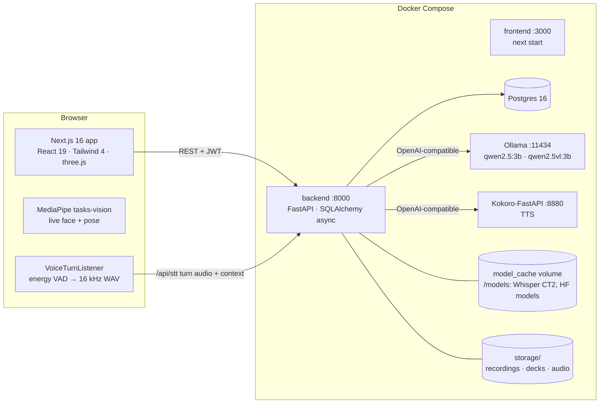

# Architecture

## System overview



Everything runs locally; OpenAI / ElevenLabs keys are optional fallbacks.

## Frontend (`frontend/`)

| Area | Path | Notes |
|---|---|---|
| Routes | `app/(auth)` login, register, onboarding · `app/(app)` home, conversation, interview, presentations, session, results/[id], progress, methodology, profile, settings | `(app)/layout.tsx` = nav + footer; `(app)/template.tsx` = page transition |
| Live session | `app/(app)/session/page.tsx` | camera stage, MediaPipe tracking, turn-taking, TTS playback, recording (MediaRecorder) |
| Turn capture | `lib/voiceTurns.ts` | adaptive energy VAD, 1.6 s end-of-turn silence, browser-filtered resample, `isBusy` |
| API client | `services/*.ts` (`api.ts` adds JWT, refreshes on 401) | |
| State | `store/` (zustand, persisted user) | |
| UI kit / 3D | `components/ui/kit.tsx`, `components/three/*`, `components/auth/VoiceOrb.tsx` | see Design_system.md |

## Backend (`backend/app/`)

| Router | Endpoints | Purpose |
|---|---|---|
| `auth.py` | `/auth/register · login · refresh · logout`, `/users/profile` | bcrypt + JWT access/refresh |
| `live.py` | `/live` CRUD, `/live/{id}/end · recording · analyze`, `/interview/plan · resume`, `/progress`, `/reports` | live sessions and their analysis |
| `conversation.py` | `/chat/message`, `/stt`, `/tts/speak`, `/tts/voices` | AI partner turns, speech in/out |
| `sessions.py` | `/sessions` (decks), slides, scripts, audio, video, `/narrator-voices` | presentation decks |
| `practice.py` | `/sessions/{id}/practice` (+ chat) | rehearsal of a deck |
| `notifications.py` | `/notifications` | bell |
| `health.py` | `/health` | binaries, local ML, LLM, TTS availability |

Background work runs in-process (`services/tasks.py` `spawn`), so **restarting the backend interrupts running analyses** (they're marked failed and can be retried).

## Key flows

### Live session
1. Interview/Q&A: setup page builds or loads a **question plan** (interview: LLM from role/resume; Q&A: cached on the deck). `POST /live` creates the session.
2. Session page: AI opening line → user turn. `VoiceTurnListener` cuts each spoken turn, `POST /stt` (with context) → text → after 1.2 s (or "I'm done") `POST /chat/message` → reply → `POST /tts/speak` → playback → next turn.
3. End: `POST /live/{id}/end` (turns, client metrics) → upload recording → `POST /live/{id}/analyze` → results page polls `GET /live/{id}`.

### Analysis pipeline (`services/live/pipeline.py`)
```
recording → 16 kHz WAV ─┬─ content feedback (LLM, started immediately, in parallel)
                        ├─ speech: ASR → fluency/fillers/stutter → pronunciation (+ prosody in parallel)
                        └─ then vision: frames → eye contact ‖ (posture → gestures) ‖ emotion
→ confidence (11 cues) → communication score → pillars → coaching plan (LLM) → progress records + notification
```
Speech and vision run one after the other on purpose: running both model sets at once exhausted 7.6 GB of RAM.

### Deck pipeline (`services/pipeline.py`)
render slides → **insights** (LLM: summary, key point per slide) → **Q&A plan** (LLM, cached in insights). About a minute. (Example scripts, narration and video were removed on 2026-10-07.)

### Presenting a deck (live "talk" session)
`POST /live {session_type: "Presentation", deck_id, presentation_mode: "talk"}` stores each slide's title, text and key point in `context.slides`. The session page shows the slides (user-controlled: ←/→, Page Up/Down, buttons) with the camera; the AI stays silent. The browser records when each slide went up (`client_metrics.slide_times`). The analysis splits the transcript's word timings at those moments and judges each slide (`services/live/talk.py`: key-word coverage, then an LLM 1–5 match with covered / missing / tip).

## Deployment

`docker compose --profile ollama --profile tts up -d --build` from the repo root. Code is **copied into the images** (no bind mounts): rebuild to deploy. Models live in the `model_cache` volume (`/models`). See agents.md for the workflow.

## Known constraints

- CPU-only inference: LLM replies 2–15 s; analysis ~1–2 min for a few minutes of talk with enough RAM.
- WSL memory defaults to half of Windows RAM; raise it (`.wslconfig`) or analyses get OOM-killed.
