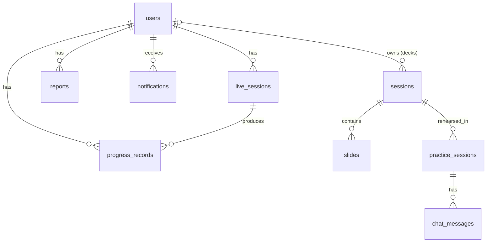

# Database

PostgreSQL 16 (Docker service `db`, database `speechmate_db`), accessed with async SQLAlchemy 2. Models: `backend/app/models/`; migrations: Alembic (`backend/alembic/`). Tests use SQLite (aiosqlite). JSON columns use `JSONType` (JSONB on Postgres).

## Entity relationships

All foreign keys cascade on delete, except `sessions.user_id` (SET NULL).

## Tables

### `users`
| Column | Type | Notes |
|---|---|---|
| id | uuid PK | |
| full_name | varchar(255) | |
| email | varchar(255) | unique, indexed |
| password_hash | text | bcrypt |
| role | varchar(50) | default `user` |
| language | varchar(50) | default `en` |
| age_group, communication_goal | varchar | optional |
| skill_level | varchar(50) | default `Beginner` |
| challenges | json | list of strings |
| created_at | timestamptz | |

### `live_sessions` (Conversation / Interview / Presentation Q&A)
| Column | Type | Notes |
|---|---|---|
| id | uuid PK | |
| user_id | uuid FK → users | indexed |
| session_type | varchar(50) | `Conversation` · `Interview` · `Presentation` |
| status | varchar(50) | `active` → `analyzing` → `complete` / `failed` |
| duration_sec | int | |
| recording_storage_path | text | under `storage/live/<id>/` |
| context | json | topic; interview `setup`, `resume_text`, `plan`, `progress`; presentation: deck id/title/summary + `kind` (`talk` with `slides` [{index, title, text, key_point}], or `qa` with `plan`) |
| turns | json | `[{role, text, t_sec}]` (text includes the user's "Fix" corrections) |
| client_metrics | json | response latencies, gaze tunneling; talk: `slide_times` [{slide_index, t_sec}] |
| analysis | json | full result: transcript, speech, vision, `communication_score`, `pillars`, `recommendations`, `content_feedback`, `details` (incl. `confidence.cues`) |
| warnings | json | what couldn't be measured |
| error_detail | text | |
| created_at | timestamptz | |

### `progress_records`
One row per metric per analysed session (fluency, pronunciation, eye contact, confidence, posture, overall, and the four pillar scores): `user_id`, `live_session_id`, `metric_name`, `metric_value` (float), `recorded_at`.

### `reports`
`user_id`, `report_type` (default `summary`), `content` (json), `created_at`.

### `notifications`
`user_id`, `kind` (`live_analysis`, `live_failed`, …), `title`, `body`, `link` (app route), `read_at`, `created_at`.

### `sessions` (presentation decks)
`user_id` (nullable), `original_filename`, `pptx_storage_path`, `voice_sample_storage_path`, `requirement_prompt`, `narrator_voice` (`fast` = Kokoro, or a Malaysian TTS voice id), `status` (`queued` → … → `complete` / `failed`), `slide_count`, `insights` (json; includes the cached `qa_plan`), `video_storage_path`, `voice_cloning_used`, `warnings`, `error_detail`, `created_at`, `updated_at`.

### `slides`
`session_id`, `slide_index` (unique per deck), `png_storage_path`, `slide_text`, `script_text`, `script_word_count`, `script_source` (`vlm` / `fallback`), `audio_storage_path`, `audio_duration_sec`, `audio_source`, `status`, `error_detail`.

### `practice_sessions` and `chat_messages`
Deck rehearsals: `session_id`, `audio_storage_path`, `recording_granularity`, `slide_index`, `status`, `transcript`, `metrics`, `feedback`, `audience_feedback`; with `chat_messages` (`role`, `content`) for follow-up coaching chat.

## Files (not in the database)

`backend/storage/` (Docker volume): deck files, rendered slides, narration audio, videos, live recordings. Deleting a session deletes its folder.

## Conventions

- UUID primary keys everywhere; timestamps are timezone-aware UTC.
- Mutating a JSON column: assign a **new** dict (`row.insights = {**row.insights, "k": v}`) so SQLAlchemy saves it.
- Analysis output is versioned by shape, not by column: readers must tolerate missing keys from older sessions (e.g. `answer` in answer feedback, `confidence.cues`).
